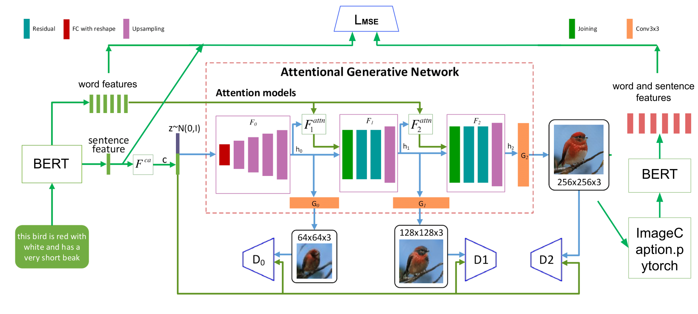

# Words to Birds: Modifying AttnGAN to use Image Captioning and BERT

Pytorch implementation for AttnGAN in [AttnGAN: Fine-Grained Text to Image Generation
with Attentional Generative Adversarial Networks](http://openaccess.thecvf.com/content_cvpr_2018/papers/Xu_AttnGAN_Fine-Grained_Text_CVPR_2018_paper.pdf) by Tao Xu, Pengchuan Zhang, Qiuyuan Huang, Han Zhang, Zhe Gan, Xiaolei Huang, Xiaodong He. (This work was performed when Tao was an intern with Microsoft Research) with pre-trained image caption networks and BERT.

### Dependencies
python 3.6+

Pytorch 1.0+

In addition, please add the project folder to PYTHONPATH and `pip install` the following packages:
- `python-dateutil`
- `easydict`
- `pandas`
- `torchfile`
- `nltk`
- `scikit-image`

**Data**

1. Download preprocessed metadata for [birds](https://drive.google.com/open?id=1O_LtUP9sch09QH3s_EBAgLEctBQ5JBSJ)
2. Download the [birds](http://www.vision.caltech.edu/visipedia/CUB-200-2011.html) image data. Extract them to `data/birds/`

**Training**
- (Reproduction only) Pre-train DAMSM models:
  - For bird dataset: `python pretrain_DAMSM.py --cfg cfg/DAMSM/bird.yml --gpu 0`
 
- Train AttnGAN models:
  - For reproduction: `python main.py --cfg cfg/bird_attn2.yml --gpu 0`
  - For modified: `python main.py --cfg cfg/bird_attn2_bert.yml --gpu 0`
- `*.yml` files are example configuration files for training/evaluation our models.
  
**Reference**

- [StackGAN++: Realistic Image Synthesis with Stacked Generative Adversarial Networks](https://arxiv.org/abs/1710.10916) [[code]](https://github.com/hanzhanggit/StackGAN-v2)
- [Unsupervised Representation Learning with Deep Convolutional Generative Adversarial Networks](https://arxiv.org/abs/1511.06434) [[code]](https://github.com/carpedm20/DCGAN-tensorflow)
